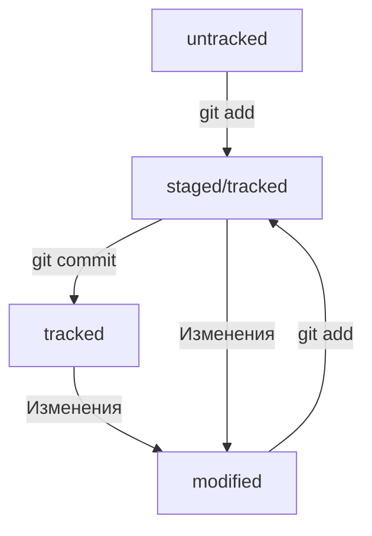

# Первый README.md

### Шрифт может быть курсивным и жирным

Первая *попытка* сделать **что-то** или ~~не сделать~~

### Фрагмент кода на СИ

```C
printf("Hello world!");
```

### Ссылка на мой GitHub

[Ссылка на мой GitHub](https://github.com/korot-7 "GitHub")

# Шпаргалка по работе с Git

### Инициализация репозитория

git init (от англ. initialize, «инициализировать») — инициализируй репозиторий

### Создание и привязывание SSH-ключей

##### Генерируем SSH-ключи
```
$ ssh-keygen -t ed25519 -C "электронная почта, к которой привязан ваш аккаунт на GitHub"
```

##### Привязывание SSH-ключей

Сначала скопируем содержимое файла с публичным ключом (.pub)
```
# скопировать содержимое ключа в буфер обмена:
$ clip < ~/.ssh/id_rsa.pub
# для ed25519:
$ clip < ~/.ssh/id_ed25519.pub
```
Перейдите на GitHub и выберите пункт Settings в меню аккаунта. В меню слева нажмите на пункт SSH and GPG keys. В открывшейся вкладке выберите New SSH key. В поле Title напишите название ключа. Например, Personal key. В поле Key type должно быть Authentication Key. В поле Key скопируйте ваш ключ из буфера обмена.

### Связываем локальный и удалённый репозитории

##### Привязать удалённый репозиторий к локальному — git remote add

Перейдите на страницу удалённого репозитория, выберите тип SSH и скопируйте URL. Откройте консоль, перейдите в каталог локального репозитория и введите команду git remote add.
```
$ git remote add origin git@github.com:%ИМЯ_АККАУНТА%/first-project.git
```

### Синхронизируем локальный и удалённый репозитории

Вы уже прошли весь «цикл коммита»: подготовили файлы с помощью git add, закоммитили их с комментарием командой git commit -m. Осталось загрузить содержимое локального репозитория на GitHub. За это отвечает команда git push

В первый раз эту команду нужно вызвать с флагом -u и параметрами origin (имя удалённого репозитория) и main или master (название текущей ветки). Флаг -u свяжет локальную ветку с одноимённой удалённой.

```
$ git push -u origin main # Если команда приведёт к ошибке, попробуйте 
                          # заменить main на master. 
```

### Хеш — идентификатор коммита

Git хранит таблицу соответствий хеш → информация о коммите

### Исследуем лог

После вызова git log появляется список коммитов:

строка из цифр и латинских букв после слова commit — это хеш коммита;

Author — имя автора и его электронная почта;

Date — дата и время создания коммита;

в конце находится сообщение коммита.

Получить сокращённый лог — git log --oneline

### HEAD

Файл HEAD — один из служебных файлов папки .git. Он указывает на коммит, который сделан последним (то есть на самый новый).

### Статусы файлов в Git

Одна из ключевых задач Git — отслеживать изменения файлов в репозитории. Для этого каждый файл помечается каким-либо статусом. Чтобы узнать какой сейчас статус, используется команда — git status. Рассмотрим основные.

**untracked** (англ. "неотслеживаемый")

Мы говорили, что новые файлы в Git-репозитории помечаются как untracked, то есть неотслеживаемые. 

**staged** (англ. «подготовленный»)

После выполнения команды git add файл попадает в staging area , то есть в список файлов, которые войдут в коммит. В этот момент файл находится в состоянии staged.

**tracked** (англ. «отслеживаемый»)

Состояние tracked — это противоположность untracked. Оно довольно широкое по смыслу: в него попадают файлы, которые уже были зафиксированы с помощью git commit, а также файлы, которые были добавлены в staging area командой git add. То есть все файлы, в которых Git так или иначе отслеживает изменения.


**modified** (англ. «изменённый»)

Состояние modified означает, что Git сравнил содержимое файла с последней сохранённой версией и нашёл отличия. Например, файл был закоммичен и после этого изменён.

### Типичный жизненный цикл файла в Git



### Добавление изменений в последний коммит

git commit --amend --no-edit (от англ. amend, «исправить») — добавь изменения к последнему коммиту и оставь сообщение прежним;

git commit --amend -m "Новое сообщение" — измени сообщение к последнему коммиту на Новое сообщение.

Важно: опция --amend работает только с последним коммитом (HEAD)

### «Откат» файлов и коммитов

git restore --staged hello.txt (от англ. restore, «восстановить») — переведи файл hello.txt из состояния staged обратно в untracked или modified;

git restore hello.txt — верни файл hello.txt к последней версии, которая была сохранена через git commit или git add;

git reset --hard b576d89 (от англ. reset, «сброс», «обнуление» + hard, «суровый») — удали все незакоммиченные изменения из staging и «рабочей зоны» вплоть до указанного коммита.

### Просмотр изменений

git diff (от англ. difference, «отличие», «разница») — покажи изменения в «рабочей зоне», то есть в modified-файлах;

git diff a9928ab 11bada1 — выведи разницу между двумя коммитами;

git diff --staged — покажи изменения, которые добавлены в staged-файлах.

### Клонирование чужого репозитория

git clone git@github.com:YandexPraktikum/first-project.git (от англ. clone, «клон», «копия») — склонируй репозиторий с URL first-project.git из аккаунта YandexPraktikum на мой локальный компьютер.

### Создание веток

git branch feature/the-finest-branch (от англ. branch, «ветка») — создай ветку от текущей с названием feature/the-finest-branch;

git checkout -b feature/the-finest-branch — создай ветку feature/the-finest-branch и сразу переключись на неё.

### Навигация по веткам

git branch (от англ. branch, «ветка») — покажи, какие есть ветки в репозитории и в какой из них я нахожусь (текущая ветка будет отмечена символом *);

git branch -a — покажи все известные ветки, как локальные (в локальном репозитории), так и удалённые (в origin, или на GitHub).

git checkout feature/br — переключись на ветку feature/br.

### Сравнение веток

git diff main HEAD (от англ. difference, «отличие», «разница») — покажи разницу между веткой main и указателем на HEAD;

git diff HEAD~2 HEAD — покажи разницу между тем коммитом, который был два коммита назад, и текущим.

### Удаление веток

git branch -d br-name — удали ветку br-name, но только если она является частью main;

git branch -D br-name — удали ветку br-name, даже если она не объединена с main.

### Слияние веток

git merge main (от англ. merge, «сливать», «поглощать») — объедини ветку main с текущей активной веткой. 

### Работа с удалённым репозиторием

git push -u origin my-branch (от англ. push, «толкнуть», «протолкнуть») — отправь новую ветку my-branch в удалённый репозиторий и свяжи локальную ветку с удалённой, чтобы при дополнительных коммитах можно было писать просто git push без -u;

git push my-branch — отправь дополнительные изменения в ветку my-branch, которая уже существует в удалённом репозитории;

git pull (от англ. pull, «вытянуть») — подтяни изменения текущей ветки из удалённого репозитория.
